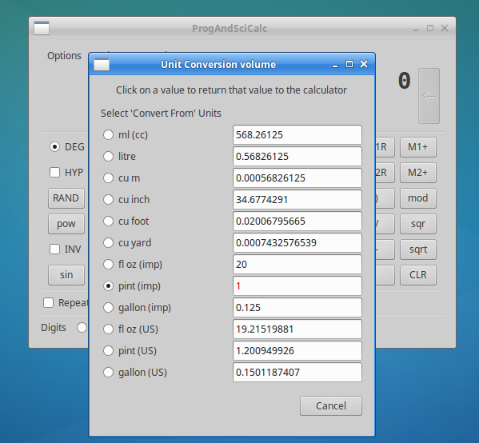
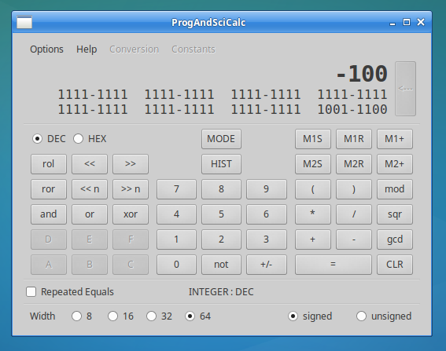
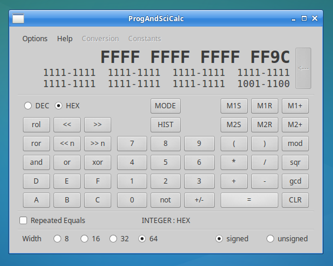

# ProgAndSciCalc
<pre>
Dual mode calculator, Integer (Programmer) mode, and Floating (Scientific) mode.
Written in C. Uses GTK2 for GUI.

MODE
Integer  - Performs operations on integers, 8, 16, 32 or 64 bits, signed or unsigned.
           The main display can be decimal or hex, the value is also shown in binary
           under the main display. (The binary display is interactive ie. you can click
           on an individual bit to toggle that bit).

Floating - uses decQuad decimal floating point type (34 digits internally). The main display
           can be configured to use from 8 to 20 digits (20 is chosen as the max because
           it's plenty, and 20 is sufficient to precisely represent all integers in the
           range of an unsigned 64 bit integer, in case that might be useful).
           Also features unit conversions, and can optionally read in constants from a
           user supplied text file.

Use the [MODE] button to switch between modes. The current value (possibly within some
limitations) is passed on when switching mode, see Mode Change section further down.

DIRECTORY FOR CONFIG AND CONSTANTS FILES
If you want the calculator to save configuration settings (otherwise it will always start
up with default configuration), you need to create a directory .ProgAndSciCalc under your
home directory. The calculator will then create a config file under this location ie.
  ~/.ProgAndSciCalc/config
This is also the location where you can optionally place a constants file (described in
more detail further down).

BINARY OPERATORS
[+] [-] [*] [/] are the usual arithmetic operations
[mod] is modulo division (ie. remainder)
[pow] is x to power y eg. 2 [pow] 3 = 8
[root] is the reverse eg. 8 [root] 3 = 2
[<< n] [>> n] are left shift and right shift by n eg. 20 [<<] 2 = 80, 20 [>>] 2 = 5
[and] [or] [xor] are bitwise operations
[gcd] is greatest common divisor eg. 9 [gcd] 6 = 3
Precedence, from low to high, is ADD_SUB, MUL_DIV, POWER_ROOT.
Associativity in all cases (including POWER_ROOT) is left to right.
eg. 1 + 2 * 3 = 7
Parentheses are available to override the natural precedence.
left/right shift has the same precedence as MUL_DIV.
gcd has the same precedence as MUL_DIV.
and/or/xor have the same precedence as ADD_SUB.

Repeated Equals checkbox
 If checked, each time [=] is entered it will re-evaluate the last binary operator
 For example :-
  10 + 2 = 12 = 14 = 16,  3 = 5,  7 = 9
  also can do eg.
  10 + = 20 = 30 = 40
  10 + 3 * = 19 = 28 = 37
 compared to when unchecked
  10 + 2 = 12 = 12 = 12,  3 = 3,  7 = 7
  10 + = 10 = 10 = 10 (it discards the dangling +)
  10 + 3 * = 13 = 13 = 13 (it discards the dangling *)

UNARY OPERATORS
Unary operators are entered after the argument eg. 100 [log] = 2
Unary operators bind the tightest, above any binary op eg. 10 + 2 * 3 [sqr] = 28
[+/-] unary minus
  In Integer mode, always treated as a unary minus operation.
  In Floating mode, treated as a unary minus operation when applied to a result,
  when entering a value it just gives a minus to the display.
  Will also change sign of exponent when entering in exponent form.
[not] invert bits
[sqr] square,  [sqrt] square root,  [1/x] one divided by x
[log] log10,  use [INV][log] for the inverse ie. 10^x
[ln] natural log, use [INV][ln] to get the inverse ie. e^x
[sin] [cos] [tan] trig functions, or sinh, cosh, tanh if [HYP] is selected
  use [INV][sin] etc. to get inverse
[<<] [>>] are left shift and right shift by 1 place
[rol] [ror] rotate (circular shift) left or right by 1 place
[x!] factorial, beware if x is not an integer value it is rounded up/down to closest integer

MISCELLANEOUS
[=] equals, evaluate all operations outstanding
[DEC] [HEX] number base,  [DEG] [RAD] [GRAD] angle units for sin, cos, tan
[F-E] force result to be displayed in exponent form
[EXP] to enter a number in exponent form
[PI] to enter PI
[M1S] memory 1 store,  [M1R] memory 1 recall,  [M1+] memory 1 plus
[M2S] memory 2 store,  [M2R] memory 2 recall,  [M2+] memory 2 plus
  memories are not saved across program restart
[RAND] random number (range can be set in Options->Settings)
[(] [)] there are 4 levels of nested parentheses
  a bracketed expression can only be started after a binary operator, or after [=] or [CLR]
[<---] to edit a user entered value
[HYP] change sin to sinh etc.
[INV] provides inverse of log, ln, sin(h), cos(h), tan(h)
[HIST] opens (or closes if already open) history window,
  history is not saved across program restart
[CLR] clear

KEYBOARD SHORTCUTS
Some of the more common functions are mapped to keyboard shortcuts, case insensitive.
  Button                Shortcut
---------------------------------------
 0-9, A-F, point       themselves
  + - * /              themselevs
    =                    RETURN
   CLR                ESCAPE, DELETE
  <---                  BACKSPACE
  MODE                     m
   +/-                     p
   DEC                     z
   HEX                     x
   EXP                     e
   INV                     i
   F-E                     f
  HIST                     h
   ()                  themselves
 unsigned                  u
  signed                   s
 width 8                 ctrl-1
 width 16                ctrl-2
 width 32                ctrl-3
 width 64                ctrl-4
It is possible to access other buttons from keyboard by using cursor keys to highlight
the chosen button then pressing SPACEBAR.

MODE CHANGE
When changing modes, the current value is passed on to the new mode.
When switching from Integer mode to Floating mode, the current integer value on the
display is converted to decQuad.
When switching from Floating mode to Integer mode, the current float value on the
display is converted (truncated) to integer. Note that this is the one case where
the rounded display value is used rather than the underlying decQuad, so the result
may depend on the number of digits selected for display. If out of range, the result
will be int_min or int_max if signed, or 0 or uint_max if unsigned. (If out of range
due to width/signedness, it's a bit unfriendly, but at this point you can change the
width/signedness, go back to Floating mode, retrieve the original value from History,
then finally return to Integer mode).
Example 1, enter 123.456 in Floating mode, switch to Integer, now have 123, switch
back to Floating mode, now have 123. The original value 123.456 can be retrieved
from History if required.
Example 2, enter 12345678901234 in Integer mode, switch to Floating at 10 digits,
value is displayed as 1.23456789e+13, switch back to Integer, it takes the display
value so now have 12345678900000. The original value 12345678901234 can be retrieved
from History if required. If set to use 14 digits it would display in Floating mode
as 12345678901234 in which case on switching back to Integer you would get the
original 12345678901234. If needs be, setting the number of digits in Floating mode
to 20 will allow any integer value to be displayed in full and avoid rounding issues.

UNIT CONVERSIONS
The Conversion menu provides unit conversion tables. The current calculator value
is taken as the value to convert. If this value is 0 then, with the exception of
temperature conversion, the value 1 is used instead.

CONSTANTS FILE FORMAT
This is an optional text file named constants, which you should place here :-
  ~/.ProgAndSciCalc/constants
The format is a category name in square brackets, followed by the entries for that
category as name=value, without any spaces around the =
For example :

[Scientific]
speed of light=299792458
Planck constant=6.62607004e-34
[Other]
something=-1.23456789
something else=9.87654321e10

The limits are :-
max 20 categories
max 15 entries per category
category name max 25 char
entry name max 40 char
entry value max 42 char

COPY and PASTE
Ctrl-C will copy the display value (copies to both default and primary clipboards)
Ctrl-V will paste from the default clipboard
Ctrl-W will paste from the primary clipboard
Pasted value is converted according to the current mode, and for Integer mode,
according to whether display is set as DEC or HEX.
</pre>

